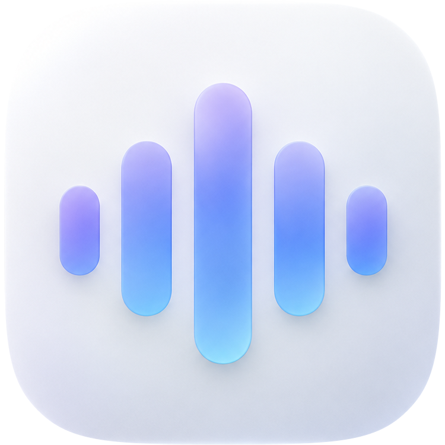

<div align="center">
  
  <h1>Orra</h1>
  <p><strong>Hold a key, speak, let go — the words are typed into whatever window has focus.</strong></p>
</div>

A desktop dictation app. It streams speech-to-text from Deepgram, AssemblyAI or
Gemini — or from a speech-to-text server you run yourself, in which case the
audio never leaves the machine. It can translate before typing, and reads text
back with Deepgram Aura — wrapped in [Tauri](https://tauri.app) so one Rust
codebase builds for Linux, macOS and Windows.

- **Streaming, not batch.** Words appear in an overlay while you speak; the
  transcript is typed the moment you release the key.
- **Interchangeable providers.** Pick on cost, accuracy and the shape of the
  transcript — including [a model on your own machine](#local-models).
- **Local by default.** Settings and history never leave your machine. Only the
  audio you dictate goes to the provider you chose — see
  [Privacy](#privacy-and-what-leaves-your-machine).

---

## Contents

- [Platform support](#platform-support)
- [Install](#install)
- [API keys](#api-keys)
- [Using it](#using-it)
- [Local models](#local-models)
- [Hotkeys](#hotkeys)
- [Where things live](#where-things-live)
- [Building from source](#building-from-source)
- [Tests](#tests)
- [Architecture](#architecture)
- [Troubleshooting](#troubleshooting)
- [Privacy and what leaves your machine](#privacy-and-what-leaves-your-machine)
- [Contributing](#contributing)
- [License](#license)

---

## Platform support

| | Linux (Hyprland) | Linux (X11 / other Wayland) | macOS | Windows |
|---|---|---|---|---|
| Dictation, translation, read-aloud | ✅ | ✅ | ⚠️ builds, untested | ⚠️ builds, untested |
| Global hotkey | ✅ via compositor | ⚠️ bind it yourself | ✅ via plugin | ✅ via plugin |
| Overlay positioned above the dock | ✅ | ➖ appears centred | ➖ | ➖ |
| Clipboard / keystroke injection | ✅ `wtype` | ✅ `xdotool` or `wtype` | ⚠️ `osascript` | ⚠️ PowerShell |
| Launch at login | ✅ XDG autostart | ✅ XDG autostart | ❌ not implemented | ❌ not implemented |
| Released as | ✅ AppImage, deb, rpm | ✅ AppImage, deb, rpm | ✅ dmg | ✅ NSIS `.exe` |

**Linux is the target that is actually exercised.** Hyprland is first-class: the
app writes its own keybinds and window rules. Windows builds and ships an
installer, but the project has not been run on it — the clipboard and keystroke
paths are written but unverified. macOS builds and ships a `.dmg`, and its
one-click local models are compiled and hosted by CI, but it has not been run
there either. Treat both as a starting point rather than a supported build — see
[Porting notes](#porting-notes-macos-and-windows).

---

## Install

### From a release

Every tagged release carries a bundle for each platform — Linux AppImage, deb
and rpm, a Windows installer, and a macOS `.dmg`. Grab the one for your system
from [Releases](https://github.com/callmearta/orra/releases).

**Arch, and anything derived from it**

```bash
yay -S orra      # or: paru -S orra
```

Built from the tagged source by the packaging in [packaging/aur](packaging/aur),
which is the same thing the AUR entry holds. It pulls in `wtype`, `wl-clipboard`
and the webview libraries itself.

**Debian / Ubuntu**

```bash
sudo apt install ./Orra_0.1.1_amd64.deb
```

**Fedora / RHEL**

```bash
sudo dnf install ./Orra-0.1.1-1.x86_64.rpm
```

**Any Linux, no install**

```bash
chmod +x Orra_0.1.1_amd64.AppImage
./Orra_0.1.1_amd64.AppImage
```

**Windows** — run the `Orra_0.1.1_x64-setup.exe` installer.

**macOS** — open the `.dmg` and drag Orra into Applications. The build is
unsigned, so the first launch needs right-click → **Open**.

The deb, rpm and AUR package declare `wtype` and `wl-clipboard` as dependencies,
so your package manager pulls them in; on an AppImage, install them yourself. On
an X11 session you want `xdotool` instead of `wtype`.

**Any Linux, sandboxed — Flatpak**

```bash
flatpak install --user --bundle orra.flatpak
```

Download `orra.flatpak` from the [releases
page](https://github.com/callmearta/orra/releases) first — or just open it, and
your desktop will offer to install it.

The Flatpak is built from the same binaries as the other packages, and types a
different way. Everything else is the same app.

A sandbox is a hostile place for a dictation app, and the interesting part of
this package is why it still works. Flatpak stamps its Wayland connection with
a *security context*, and compositors hide their privileged protocols from any
client carrying one:

```
zwp_virtual_keyboard_manager_v1      ← wtype's entire mechanism
zwlr_data_control_manager_v1
hyprland_global_shortcuts_manager_v1
```

On Hyprland and every other wlroots compositor those are withheld, and Mutter
and KWin never implemented the first one at all. So no binary shipped inside
the sandbox could type with them — bundling `wtype` buys nothing anywhere.

What does work is `/dev/uinput`: Orra asks the **kernel** for a keyboard, and
the compositor picks it up through libinput exactly as it would real hardware.
That is not a protocol client, so no compositor filters it, and it behaves
identically on GNOME, KDE, Hyprland and wlroots. It is why the Flatpak asks for
`--device=all`, which is the broadest permission here and the one thing that
makes typing possible at all.

The clipboard is untouched by any of this: `wl-copy` works inside the sandbox,
so the default **Paste it in** mode — put the transcript on the clipboard,
synthesize Ctrl+V — is the reliable one, and it handles any language, where a
synthetic keyboard can only type what the active layout has keys for.

The tray needs one thing the runtime does not carry: `libayatana-appindicator`
and the two libraries under it. The app loads it at runtime rather than linking
it, so a runtime without it costs the tray icon silently — which is why the
package builds the tray stack rather than relying on what is already there.

One consequence worth knowing:

- **Hold-to-talk goes through one extra process.** The compositor bind runs
  `flatpak run --command=orra-ctl`, which costs about 60ms before recording
  starts — not enough to clip a word, but if you want it exact, `Type it out`
  and Toggle mode are both unaffected.

On Hyprland the Flatpak writes its binds and its overlay rule into
`~/.config/hypr/config` exactly as the other packages do, which is what the
`--filesystem=xdg-config/hypr` in the manifest is for. Delete the managed block
and it is gone.

### From source

See [Building from source](#building-from-source).

---

## API keys

You need **one** key for the provider that transcribes, and a **Deepgram** key
if you also want read-aloud (that is the only service whose voices Orra
uses). Translating needs a **Gemini** key as well, unless you point Translation
at your own OpenAI-compatible endpoint.

| Provider | Where to get a key | Free tier |
|---|---|---|
| Deepgram | <https://console.deepgram.com> | Yes, $200 credit |
| AssemblyAI | <https://www.assemblyai.com/dashboard> | Yes, limited hours |
| Google Gemini | <https://aistudio.google.com/apikey> | Yes, rate-limited |

Everything under [Local models](#local-models) needs no key at all unless your server asks for
one, and the environment is never consulted for it — there is no convention to
name such a variable, so what is in Settings is what is sent. See
[Local models](#local-models).

There are three ways to supply a key. **Resolution order is: environment → a
nearby `.env` → the value saved in Settings**, so an exported variable always
wins over anything pasted into the UI.

**1. A `.env` file at the repo root** (or next to the binary). This is what the
tests read, and the easiest for a source build:

```bash
# /path/to/orra/.env
DEEPGRAM_API_KEY=your_key_here
ASSEMBLYAI_API_KEY=your_key_here
GEMINI_API_KEY=your_key_here
```

Only the key for the provider you are actually using has to be present. The file
is in `.gitignore` — **never commit it.**

**2. Environment variables**, for a shell or a launcher:

```bash
export DEEPGRAM_API_KEY=your_key_here
```

**3. Settings → paste it into the box for the provider.** This writes it in
plain text to `~/.config/orra/config.json`, so prefer one of the other two if
your home directory is backed up or synced somewhere you would not put a
credential. Click **Verify key** to check it against the provider.

---

## Using it

### Dictating

**Hold `SUPER + ALT + D`** (on macOS `CONTROL + ALT + D`) and speak. A rising tone marks the
start; a falling tone the end. Release, and the transcript is pasted into
whatever window has focus.

The overlay near the bottom of the screen shows the transcript live. Releasing
the key takes the overlay away at once — the audio is still being flushed to the
provider and the text has not been typed yet, which is what the falling tone
marks.

The language button on the Dictate page opens the full list for whatever is
transcribing — every language Deepgram or the server you pointed at accepts —
and picking one applies to the next dictation. `SUPER + ALT + L` steps through
the short list from the Voice page instead, for switching between two languages
without leaving the keyboard. Neither applies to Gemini, which works the
language out for itself.

### Translation

Hold the translating key (default `SUPER + ALT + T`) and speak. The dictation is
transcribed as usual, translated, and *that* is typed. Set the target language
and service under **Settings → Translation**.

Translation runs on Gemini by default, whichever provider is transcribing, and
has a key field of its own under **Settings → Translation** — a Gemini key used
only for translating is the ordinary case when something else is hearing the
audio. Left empty, it falls back to `GEMINI_API_KEY` or the key on the
transcription card, and **Use the transcription key** copies that one across. It
can also run against **any OpenAI-compatible endpoint** — OpenAI, OpenRouter,
Groq, or a model on your own machine — by
setting the service to *Custom endpoint* and giving it an API URL, a model name
and a key (a local server usually wants no key). The URL is the base one,
ending at `/v1`; `/chat/completions` is appended to it. **Test translation**
sends one short phrase through whatever is configured — including Gemini, which
is the only way to check a Gemini key that is used for translating and not for
transcribing — so a wrong key, model or URL is found in Settings rather than
mid-dictation.

Translation is one extra round trip after you stop speaking, which is why it
has a key of its own rather than being something every dictation waits for.
If it fails, the words you actually said are typed instead and the reason is
shown. The history entry keeps both: the translation as the dictation, and the
original underneath it.

### When something fails

A failure is shown as a card at the top of the window, and it stays there until
you close it — the failures that matter happen while you are looking at another
window, so it is not something to miss in four seconds.

It leads with what kind of failure it was (`Could not reach the service`, `The
API key was refused`, `Not set up yet`) and what to do about it, then the error
itself. **Copy log** puts all of that plus the version and the platform on the
clipboard, which is what to send with a bug report. API keys are stripped out
of it before it is shown or copied, so it is safe to paste.

### Read aloud

**Read aloud** speaks the last transcript, or any entry in the history, using
Deepgram Aura (`aura-2-thalia-en` by default). This always needs a Deepgram key,
whichever provider transcribes. Change the voice under **Voice → Speaking**.

### Voice commands

Say these while dictating. Toggle the whole feature under **Dictionary &
Formatting → Formatting → Voice commands**.

| Say | Get |
|---|---|
| `new line` | a line break |
| `new paragraph` | a blank line |
| `press enter`, `hit enter`, `send it`, `submit that` | the text is submitted |
| `question mark` / `exclamation mark` / `exclamation point` / `full stop` | `?` / `!` / `!` / `.` |
| `open paren` / `close paren` (or `open parenthesis` / `close parenthesis`) | `(` / `)` |
| `semicolon` / `hyphen` | `;` / `-` |
| `scratch that`, `delete that`, `cancel that`, `never mind that` | the previous dictation is deleted |

Any of them can be marked with a spoken `slash` — `slash new line`, or `/new
line` if that is how the transcriber heard it — which is worth doing for the
ones that are ordinary English too, like `new line` in "add a new line of
products". The marker is not required; it only makes the intent explicit.

Matching ignores the punctuation the transcriber adds, because a spoken command
is not normal speech and gets punctuated as if it were: `new line` arrives as
`new line,`, `new line.` or `new. Line,` depending on where smart formatting
decided the sentence ended. The punctuation around a command is taken with it
when it is replaced, so the comma that followed the command does not surface at
the head of the new line.

Deliberately absent: `period`, `comma`, `colon`, `dash`. They are ordinary nouns,
and rewriting them mid-sentence does more harm than good. Add them under
**Snippets & Shortcuts → Rules** if you want them.

**Filler removal** (the **Remove filler words** toggle beside it) drops standalone `um`, `uh`,
`hmm` and friends — `um, umm, uhm, uh, uhh, erm, hmm, mmm, mhm, hm` — along with
any comma left hanging off them.

### Words

- **Dictionary** — names and jargon, sent to Deepgram as keyterms so nova-3
  expects them. Deepgram only; the other providers take no keyterms.
- **Snippets & Shortcuts → Rules** — applied after transcription,
  case-insensitively and on word boundaries. Doubles as text expansion: map
  `my signature` to your full sign-off.

### History and Insights

**Transcripts & Notes** keeps the last 5,000 dictations in
`~/.config/orra/history.jsonl`. Copy, re-insert, read aloud or delete any of
them. **Insights** aggregates over the same file — words per minute, streak,
where you dictate, vocabulary breadth.

---

## Local models

Dictation does not have to leave the machine. **Settings → Transcription
service → Provider** lists the servers people actually run, each named for
itself, and choosing one fills in the address it normally answers on. The audio
goes to that address and nowhere else.

| Provider | Endpoint it fills in | Type |
|---|---|---|
| Ollama | `http://localhost:11434/v1` | HTTP |
| [Speaches](https://speaches.ai) (formerly faster-whisper-server) | `http://localhost:8000/v1` | HTTP, or WebSocket for live text |
| [LocalAI](https://localai.io) | `http://localhost:8080/v1` | HTTP, or WebSocket for live text |
| [whisper.cpp](https://github.com/ggml-org/whisper.cpp) `whisper-server` | `http://localhost:8080/inference` | HTTP |
| Custom endpoint | whatever you paste | HTTP, or WebSocket |
| Orra — open-source models | filled in for you | HTTP |

The address stays editable whatever you pick — ports are not always the default
— and OpenAI, Groq, Mistral and OpenRouter are reachable through **Custom
endpoint** with their own URLs.

**Ollama** is in the list for its audio-capable models (`gemma4` and up) rather
than for its own sake: it is an LLM server, and `/v1/audio/transcriptions` is not
something it has always answered. A dedicated whisper server is the safer
choice.

**Orra — open-source models** is the entry that needs nothing installed first.
Pick a model, press **Download**, then **Use this model**, and Orra fetches the
engine ([whisper.cpp](https://github.com/ggml-org/whisper.cpp)) and the weights,
starts the server itself, and fills in the address and the transport to match.
Nothing is added to the app bundle: the weights land in
`~/.local/share/orra/models` and the engine in `~/.local/share/orra/bin`, both
checked against a sha256 pinned in the binary as they arrive — one of them is
executed, so what gets executed is what was reviewed. The engine runs until you
press **Stop** or quit Orra, and a large model holds a couple of gigabytes of
memory while it does. whisper.cpp publishes no command-line build for macOS —
Apple gets an xcframework — so Orra compiles and hosts that one engine itself,
and macOS downloads it the same way, hash and all.

### Type

How Orra talks to the server. The three are not interchangeable in what you get
back, which is the whole reason the choice is yours:

- **HTTP** posts the recording when you release the key, and the transcript
  lands a moment later. This is the OpenAI `/audio/transcriptions` shape, and
  every one of those servers answers it. Orra appends `/audio/transcriptions` to
  the URL you give it, unless you pasted a path that is already an endpoint —
  whisper.cpp's `/inference` is used exactly as typed.
- **HTTP (streaming)** sends the same request with `stream=true` and reads the
  transcript out as the server decodes it, so a long dictation fills the overlay
  rather than appearing all at once. Still nothing until you release the key:
  the audio does not exist before then.
- **WebSocket** is the OpenAI Realtime API, and it is the only one that shows
  words *while you are speaking*, the way the cloud providers do. OpenAI,
  LocalAI, Speaches and vLLM implement it. Audio is resampled to the 24 kHz the
  session declares.

A server that does not implement the transport you picked will either refuse the
connection or answer with an error naming what it did not understand — the Type
is the setting to try changing first.

### Model

Type it, or press **Fetch models** to ask the server what it has
(`GET {endpoint}/models` — the same call fills in the translation endpoint's
model field, which is how an Ollama model gets picked rather than remembered).
The button is only offered where the server actually publishes a list: Ollama,
Speaches, LocalAI and a custom endpoint. whisper.cpp transcribes with the model
it was started with, and so does the engine Orra runs, so neither has one.

**Check server** transcribes half a second of silence and reads the reply. That
is the only check that covers the address, the port, the transport, the model
name and the key together — and it is the same code path a dictation takes, so a
pass here means dictating will work. Asking for a model list instead would fail
on every server that does not publish one.

### What is different from the cloud providers

- **Nothing is typed until the transcript arrives.** With HTTP that is on
  release; the words are not edited, translated or injected any differently —
  voice commands, replacements, translation and the trailing space all work the
  same way.
- **No confidence figures.** These servers do not report any, so local
  dictations are left out of the confidence average in Insights rather than
  guessed at.
- **Accuracy and speed are yours to trade.** A large model on a CPU is slower
  than real time and rarely matches nova-3; a small one is quick and makes more
  mistakes. The model name is the dial.

---

## Hotkeys

### Hyprland

Wayland has no global-shortcut protocol, so on Hyprland the keys are registered
by the compositor rather than the app. Pressing **Apply** in Settings writes a
delimited block to:

- `~/.config/hypr/config/keybinds.lua` — the dictate, translate and language binds
- `~/.config/hypr/config/settings.lua` — the overlay's window rule

then runs `hyprctl reload`. The block is idempotent and replaced in place, never
duplicated, and both files are backed up once to `*.lua.orra.bak` before the
first edit. Delete the lines between the `orra (managed block)` markers to
remove it by hand.

> **Note:** this targets a **Lua** Hyprland config
> (`~/.config/hypr/config/*.lua`). If yours is the older `hyprland.conf` format,
> the app cannot write your binds and `hyprctl reload` will report an error —
> bind `orra-ctl` yourself as described below.

The binds call `orra-ctl`, which talks to the running app over a loopback
socket; spawning a whole Tauri process per keypress would be far too slow. The
port and a shared token live in `~/.config/orra/config.json`.

### Any other Linux setup

`orra-ctl` is a standalone binary and works on any compositor. Bind it
yourself — in Sway, for example:

```
# ~/.config/sway/config
bindsym --release $mod+Mod1+d exec orra-ctl toggle
bindsym $mod+Mod1+t exec orra-ctl translate
bindsym $mod+Mod1+l exec orra-ctl lang-next
```

Its commands:

| Command | Effect |
|---|---|
| `start` / `stop` | begin or end a dictation |
| `toggle` | start if idle, stop if recording |
| `translate` | a dictation that is translated before typing |
| `lang-next` / `lang-prev` | step the dictation language |
| `lang <code>` | switch to a specific code, e.g. `orra-ctl lang fa` |
| `speak [text]` | read text aloud, or the last transcript if given none (also reads stdin) |
| `open` | raise the settings window |
| `status` | print `recording=true` or `recording=false` |
| `quit` | exit Orra |

For a hold-to-talk bind you need both edges:

```
bindsym --release $mod+Mod1+d exec orra-ctl stop
bindsym $mod+Mod1+d exec orra-ctl start
```

`orra-ctl` is installed next to the app binary. If you run from a source
build it is in `src-tauri/target/release/`, so use the full path in your bind.

### macOS and Windows

`tauri-plugin-global-shortcut` registers the keys in-process, so a hold bind
works the same way it does on Hyprland. The defaults differ on macOS for one
reason: the system reserves the Command+Option chords — `⌘⌥D` toggles the Dock —
so dictate, translate and step-language default to `CONTROL + ALT + D/T/L`
there instead, which nothing else claims. A config still holding the old default
is moved over on first launch; a key chosen by hand is left alone.

macOS asks for Accessibility permission the first time text is injected through
System Events, for Automation permission to drive it, and for the microphone the
first time you dictate.

---

## Where things live

| What | Path |
|---|---|
| Settings | `$XDG_CONFIG_HOME/orra/config.json` (or `~/.config/orra/config.json`) |
| History | `$XDG_CONFIG_HOME/orra/history.jsonl` |
| Autostart entry | `$XDG_CONFIG_HOME/autostart/orra.desktop` (when enabled) |
| Hyprland backup | `~/.config/hypr/config/*.lua.orra.bak` |

Deleting the `orra` config directory resets everything.

---

## Building from source

### Prerequisites

| | |
|---|---|
| Rust | 1.85 or newer (the crate is edition 2024) |
| Node.js | 20 or newer, for the frontend |
| Tauri CLI | `cargo install tauri-cli --version '^2'` (only for `cargo tauri`) |

**Linux** also needs the WebKitGTK stack and two small input tools:

```bash
# Arch
sudo pacman -S webkit2gtk-4.1 base-devel wtype wl-clipboard

# Debian / Ubuntu
sudo apt install libwebkit2gtk-4.1-dev build-essential curl wget file \
  libxdo-dev libssl-dev libasound2-dev libayatana-appindicator3-dev librsvg2-dev \
  wtype wl-clipboard
```

`libasound2-dev` is the one people miss: `cpal` links ALSA to capture the
microphone, and without it the build fails in `alsa-sys` with
`Package alsa was not found in the pkg-config search path`.

For an X11 session, swap `wtype` for `xdotool`. For Wayland compositors that do
not expose the virtual-keyboard protocol `wtype` needs, `ydotool` is used as a
fallback for the paste keystroke — though not for typing text or for Enter.

**macOS**: Xcode command line tools. **Windows**: the MSVC toolchain and
WebView2.

### Build

```bash
# 1. Frontend — the Rust crate embeds the built output at compile time,
#    so this has to run before cargo does.
cd ui
npm ci
npm run build

# 2. App
cd ../src-tauri
cargo run                  # debug build; the UI is embedded, so it runs on its own
cargo build --release      # optimised binary
cargo tauri build          # release bundle (adds src-tauri/target/release/bundle/)
cargo tauri dev            # dev server + hot reload for UI edits
```

`cargo run` needs neither the Tauri CLI nor a dev server: the `custom-protocol`
feature is on by default, which embeds the frontend and serves it over
`tauri://`. Without it a plain build bakes in the URL of `tauri dev`'s static
server and shows a 404 unless that exact server happens to be the one running.
`tauri dev` is the only build that wants the server, and the CLI strips the
feature back out for it.

`build.rs` watches `ui/dist`, because those assets are baked
in when the Rust crate compiles and cargo cannot see the dependency on its own —
without it, a rebuilt frontend leaves the previous bundle embedded and the app
serves a UI that is no longer on disk.

**The app is single-instance:** starting it while a copy already runs raises that
window and exits. So a `cargo run` that appears to do nothing means an older
build is still alive (`pkill -x orra`).

`tauri.conf.json` asks for a `.deb` by default, which keeps a local
`cargo tauri build` quick. Ask for the others explicitly when you want them:

```bash
cargo tauri build --bundles appimage,deb,rpm
```

The AppImage needs `patchelf` and `libfuse2`; the rpm needs `rpm`.

### Porting notes (macOS and Windows)

Windows is built and released by CI (`.github/workflows/release.yml`, an NSIS
`.exe`), and macOS as a `.dmg`. The macOS bundle needs no change to
`tauri.conf.json`'s `bundle.targets`: CI passes `--bundles dmg` explicitly, and
that overrides the `deb` default there. Three things are macOS-only and already
wired up — the `macos-private-api` feature beside `macOSPrivateApi`, which a
transparent HUD window requires; the `Info.plist` carrying the microphone and
Apple Events usage strings, without which macOS kills the app the moment it
records; and `entitlements.plist`. The last one is easy to miss because nothing
fails loudly without it: Tauri signs macOS builds with the hardened runtime, and
under it TCC will not grant the microphone — or even show the prompt — without
`com.apple.security.device.audio-input`. Recording then opens the device, gets
silence, and reports no error.

Signing is not ad-hoc, and that is deliberate. TCC matches an app by its *code
requirement*, and an ad-hoc signature's requirement is the binary's own hash —
so every build looks like a different app and macOS asks for the microphone and
Accessibility again, or, worse, leaves the Accessibility toggle looking on while
denying the event posting behind it. `bundle.macOS.signingIdentity` names a
Developer ID Application certificate instead, whose requirement is the team ID
and never changes, so a grant survives updates. CI needs that certificate as
secrets (`APPLE_CERTIFICATE` and `APPLE_CERTIFICATE_PASSWORD`, exported as
Tauri's macOS signing docs describe); notarizing with the same account —
`APPLE_ID`/`APPLE_PASSWORD`/`APPLE_TEAM_ID`, or the App Store Connect key — is
what removes the Gatekeeper warning on download. Without the secrets the macOS
job cannot sign and fails, which is the one thing to set up before the next
release.

The engine the one-click local models download is not upstream on macOS:
whisper.cpp publishes only an xcframework, so the release workflow compiles a
universal `whisper-server` itself, checksums it, bakes the hash into the app
through `ORRA_MACOS_ENGINE_SHA256`, and attaches the archive to the release. A
plain `cargo build` has no hash to pin, so it hides that feature rather than
offering a download it cannot check.

Launch-at-login is Linux-only: `set_launch_at_login` in `src-tauri/src/commands.rs`
returns an error elsewhere and needs a LaunchAgent on macOS and a registry key on
Windows. The overlay is positioned by a Hyprland window rule, so on other
platforms it appears wherever the toolkit centres it.

### Releasing

Pushing a tag matching the version in `src-tauri/tauri.conf.json` builds every
platform and publishes them to one GitHub Release:

```bash
git tag v0.1.1 && git push origin v0.1.1
```

Bump the version in `src-tauri/tauri.conf.json`, `src-tauri/Cargo.toml` and
`ui/package.json` first — the workflow refuses to build if
the tag and the app version disagree. Running the workflow by hand from the
Actions tab builds the same bundles without publishing anything.

---

## Tests

```bash
# Rust — offline unit tests, no keys or network needed
cd src-tauri && cargo test

# Live round trips against the real APIs (needs keys in .env or the environment)
cargo test -- --ignored --nocapture

# Frontend
cd ui && npm test

# Lints
cd src-tauri && cargo clippy --all-targets
```

The ignored tests synthesize a sentence with Aura, stream it back through the
listen socket, and assert it comes back as words — a genuine end-to-end check of
both endpoints, including that `multi` transcribes correctly and that
`detect_language` is never sent (the streaming endpoint rejects it).

The local provider is covered without a server: loopback stubs in `local.rs`
assert what actually goes on the wire — the multipart fields, the SSE deltas,
the Realtime session update and its event parser — because on that path the
request *is* the feature, and a server that never sees the field it wants has no
way to say so.

---

## Architecture

```
src-tauri/src/
  main.rs        app setup, tray, HUD window, and the loopback control socket
  commands.rs    the #[tauri::command] surface the settings UI calls
  state.rs       shared state, the dictation lifecycle, history persistence
  stt.rs         one streaming session loop for every provider
  deepgram.rs    ┐
  assemblyai.rs  ├ each provider's URL, framing and message parser
  gemini.rs      ┘
  local.rs       a server you run: HTTP, SSE, and the Realtime socket
  audio.rs       microphone capture (cpal) and playback (rodio)
  polish.rs      transcript → typed text: fillers, voice commands, replacements
  translate.rs   translation: Gemini, or any OpenAI-compatible endpoint
  problem.rs     a failure as the user sees it: kind, advice, and the log to send
  inject.rs      clipboard and keystroke delivery, per platform
  hotkeys.rs     global shortcuts; defers to hypr.rs on Hyprland
  hypr.rs        the managed Lua blocks and the overlay's window rule
  config.rs      settings persistence and key resolution
  stats.rs       the Insights aggregates
  bin/ctl.rs     orra-ctl — the tiny client the compositor binds call

ui/   React + TypeScript + Vite + Tailwind settings UI
  src/pages/               one file per screen
  src/lib/stats.ts         presentation helpers (the arithmetic lives in Rust)
```

Two design choices worth knowing before changing things:

- **One session loop, every streaming provider.** `stt.rs` owns the connect →
  feed → drain → flush state machine. Everything provider-specific is behind the
  `Wire` struct: what to send on open, how audio is framed, how a server message
  is read, what closes the stream, how long a flush is given. Adding a provider
  means writing one module, not another loop — the local provider's WebSocket
  transport rides the same one, and only its HTTP transports run separately,
  because they cannot hand over any audio until the recording has ended.
- **The arithmetic is in Rust.** Streaks, words-per-minute and month boundaries
  live in `stats.rs` so `cargo test` covers them; the frontend only lays out what
  that returns.

---

## Troubleshooting

**Nothing happens when I press the hotkey.** On Hyprland, open Settings and press
**Apply** — the bind is written to your compositor config, not registered by the
app. Check `hyprctl configerrors`. On a non-Lua Hyprland config, or any other
compositor, bind `orra-ctl` yourself (see [Hotkeys](#hotkeys)).

**`orra-ctl` says "orra is not running".** The app is not up, or it could
not bind its control port. Look for `cannot listen on 127.0.0.1:<port>` on
stderr — usually a second copy already running.

**"no key injection tool found (install wtype)".** Install `wtype` (Wayland) or
`xdotool` (X11), and `wl-clipboard` for the clipboard path.

**Text arrives in the wrong application, or not at all.** Injection puts the text
on the clipboard, synthesises Ctrl+V (Ctrl+Shift+V in terminals, detected by
window class), then restores your clipboard. If your terminal is missing from the
list in `src-tauri/src/inject.rs`, add it — or switch to **Type it out** in
Settings for apps that mangle paste.

**The window is blank, or the app dies the moment it opens (NVIDIA).** WebKit's
DMABUF renderer is broken on the NVIDIA driver. Orra sets
`WEBKIT_DISABLE_DMABUF_RENDERER=1` automatically when it finds the driver loaded,
and leaves it alone otherwise since the fallback renderer is slower. Set that
variable yourself to override the decision either way.

**The overlay appears in the middle of the screen.** That is expected outside
Hyprland. A Wayland client cannot position itself, and the window rule that does
it on Hyprland has no equivalent elsewhere.

**Persian (or another language) transcribes as English.** Deepgram's
`detect_language` is batch-only — the streaming endpoint rejects it with
`400 Bad Request: Language detection is only supported for batch.` The default is
therefore nova-3's `language=multi`, which follows switching between the ten
languages it covers (English, Spanish, French, German, Hindi, Russian,
Portuguese, Japanese, Italian, Dutch). Anything outside that set needs its code
selected explicitly — press the language key, or add codes under **Voice →
Languages to switch between**. AssemblyAI streaming covers 18 languages and
silently *ignores* an unsupported code, so Orra only sends the ones it
supports. Gemini detects the language itself and takes no codes.

**Nothing appears until I let go of the key (local server).** That is HTTP. Only
the WebSocket transport can show words while you are still speaking, because the
other two have no audio to send until the recording has ended. If your server
speaks the Realtime API — OpenAI, LocalAI, Speaches, vLLM — set Type to
**WebSocket**.

**"Fetch models" fails on my local server.** Not every one of them publishes a
list — the button is only offered where they do, so being able to press it means
the server should answer. A server that replies with HTML is telling you it is
not an OpenAI-compatible API in the first place. The field is free text either
way.

**"Orra — open-source models" offers no models to download.** The block is drawn
from `engine::ASSET`, which is `None` when there is no engine to fetch — a
platform upstream publishes nothing for, or a `cargo build` made without
`ORRA_MACOS_ENGINE_SHA256`, which is the hash of the engine Orra builds for
macOS and only the release workflow knows. Releases carry it on every platform.
Point **Custom endpoint** at a server you run instead.

**A local dictation types nothing, or the server refuses the request.** The
error quotes what the server said, and it usually names the setting at fault:
`model not found` wants the model field filled in (or the model pulled on the
server), and a connection refused means nothing is listening on that port. The
same server has to be running before you dictate — Orra does not start it.

**`cargo build` fails with a missing `dist`.** The frontend has to be built
first — see [Building from source](#building-from-source).

---

## Privacy and what leaves your machine

- **Audio** goes only to the provider you configured, over TLS, while you hold
  the key — or, with any of the [local providers](#local-models), to a URL on
  your own network and nowhere else. Orra still sends it; point that URL at a
  server on this machine and it never crosses the network at all.
- **Transcripts** are sent to that provider for the duration of the stream, to
  Deepgram a second time if you use read-aloud, and to the translation service
  — Gemini, or the endpoint you configured — if you use translation.
- **Settings and history never leave your machine.** They are plain files under
  `~/.config/orra/` — no telemetry, no analytics, no accounts.
- **API keys** are read from the environment or a `.env`, or stored in plain text
  in `config.json` if you paste them into Settings. `.env` is gitignored; keep it
  that way. Keys are stripped out of the error log that **Copy log** puts on the
  clipboard, because that text is meant to be sent to someone.
- **The control socket** listens on `127.0.0.1` only and requires a shared token,
  generated on first run into `config.json`, so unrelated local processes cannot
  make the app type.

Dictation history is not encrypted. If that matters to you, keep the config
directory on an encrypted volume and delete entries you do not want to keep.

---

## Contributing

Issues and pull requests are welcome. Before opening a PR:

```bash
cd src-tauri && cargo test && cargo clippy --all-targets
cd ../ui && npm run build && npm test
```

Both should be clean. The code is commented to explain *why* rather than *what* —
please keep that up. The tests are the specification for the fiddly parts
(voice-command matching, the transcript-to-text rules, the Insights arithmetic),
so add one alongside a change there.

---

## License

No license is granted yet — all rights reserved. If you want to use this code,
please open an issue.
